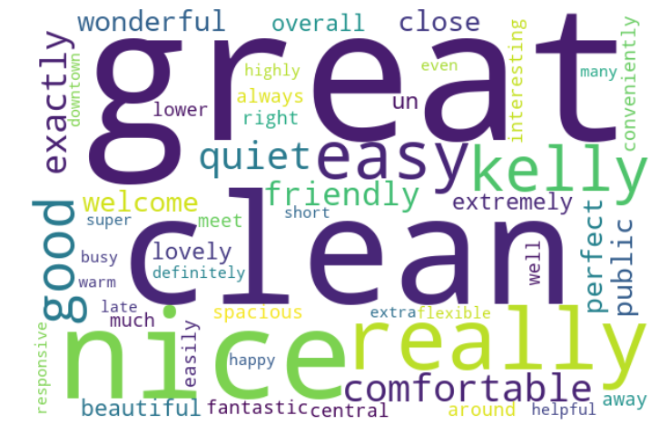

# Table of Contents
<!-- MDTOC maxdepth:6 firsth1:1 numbering:0 flatten:0 bullets:1 updateOnSave:1 -->

- [Table of Contents](#table-of-contents)   
- [Installation](#installation)   
- [Project Motivation](#project-motivation)   
- [File descriptions](#file-descriptions)   
- [Results](#results)   
- [Licensing, Authors, Acknowledgements](#licensing-authors-acknowledgements)   

<!-- /MDTOC -->

# Installation
The dataset used in this project is availanle on kaggle:
https://www.kaggle.com/airbnb/seattle/data
https://www.kaggle.com/airbnb/boston

the required python package includes:numpy, pandas, matplotlib, seaborn, string
nltk,wordlcloud

# Project Motivation
This is a term porject for my udacity datascience nanodegree. In this project,
the airbnb data of Seattle area and Boston area were analyzed. This analysis
focuses on three sections.
1. I will exam the types of amenities that appear the most in bosth
Seattle airbnb host and Boston Airbnb host
and exam whether there is a regional difference.
2. I am interested in finding
 out how the objective features of the host that affect the price. These
 features including location, number of bedroom, number of bathroom, bed type
  ,property type, amenitites and cancellation policy.
3. Since the data contains customer reiews. I am interesting the most frequency
 words that appear in reviews for high rating host and low rating host.

# File descriptions
Folder"seattle", "boston" contains the raw data downloaded from kaggle
Folder"draft and note" contains some draft juppyter notebook script and my project note. This note will be used as a study material for review in future.
File Airbnb(Seattle,Boston) data analysis.ipynb contains the code for this project.

# Results
For Section 1:

The hosts in both Seattle and Boston area have many amenities in common, including Interest, heating, Kitchen, smoke detector, essentials, dryer, washer, TV, carbon monoxide detector and kid friendly environment.
However, many host in seatle area provide first aid kit, free parking and fire extinguisher. In contrast, many the host in Boston area have air conditioning, Hangers, laptop friendly workspace.
It seems that safety is a core value for many seatle airbnb host. In addtion, the parking space in seattle area is much more flexible than boston area.
The boston hosts are white collar friendly. Many of them provide hanger to hang suits and laptop workspace for people who needs to work remotely or on a business trip.
One interesting I found is that many seatle hosts do not provide air conditioning. The weather in seattle is not extreme cold in winter or extreme hot in summer.

Section 2:

In the above plot, the features that have the most positive effect and most negative effect on price are listed.
For both area, the location of host plays a important role on price. It seems that in Seattle area, the host in Downtown, Cascade, Queen Anne and Capito Hill area usually have a higher pice, while the hosts in Ballard, Seward parking, Beacon Hill, University District have a lower price.
To verify this information, I plot the price/bed of each host on a map:

THe brighness of each dot represents the price/bed. This is in agreement with the modeling results.

Here is the price mapping for boston area:

This is also in agreement with the modeling results.

Section 3:
The most frequently used adjective and adverb words in reviews for high rating host :

The most frequently used adjective and adverb words in reviews for low rating host :

The most verb used adjective and adverb words in reviews for high rating host :

The most verb used adjective and adverb words in reviews for low rating host :

# Licensing, Authors, Acknowledgements
Author Haochen X(jbdx6307@gamil.com)
